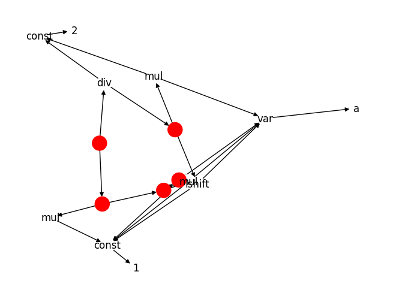

## Integer Optimizations with (A)E-Graphs for PyPy JIT

### Problem Statement

Optimizing compilers, especially JIT compilers such as PyPy, can benefit from optimizing sequences of integer operations by using rewrite rules into an expression that's less expensive according to some compiler-defined cost model. These rules require domain-specific knowledge as they must pass formal verification and bounds checking using a SMT solver like Z3. The application of these rewrite rules also runs into the phase-ordering problem of missed optimizations since rewrite rule application is destructive of the original expression. This work proposes the use of e-graphs for both these problems.  This work uses Enumo to create a ruleset almost 2x the size of the existing PyPy one without domain-specific knowledge. We also implement a minimized version of Acyclic E-graphs (AEgraphs) into the PyPy integer optimization framework, leading to application of multiple rewrite rules for up to 4x shorter expressions in some cases.

### Introduction

PyPy is a Just-In Time (JIT) compiler that serves as a faster replacement of CPython. Integer optimizations, specifically more local
peephole optimizations are more relevant for a JIT compiler than an Ahead-Of-Time (AOT) compiler, which can run more advanced global passes on the entire program CFG. PyPy uses a custom DSL to express rewrite rules for such optimizations. A rewrite rule takes an expression in a certain form and replaces it in another form that is more optimal, based on some heuristic like cost of execution. The canonical example for such an optimization is ($a \times 2 \implies a << 1$), as
bitshifts are cheaper to execute than multiplications on most architectures. While the DSL is useful for expressing rewrite rules, it still
requires domain specific knowledge to write them. Rewrite rule inference is a field that has been gaining some traction recently, with
works like Enumo and Isaria. The former is a DSL provides a small
set of core operators that enable users to strategically guide rule
inference and incrementally build complex rulesets. The application
of these rules also faces the issue of phase ordering, as applying
these rewrites greedily might not allow some other more optimal
rule to be applied. Consider program $(a \times 2)/2$ . PyPy may optimize
the subexpression $a \times 2$ into $a << 1$ and get $(a << 1)/2$, after which
it cannot further optimize the program. Alternatively it can also
realize that the multiplication and division operators can be simply
canceled out, yielding $a$. This indicates that applying one optimization may disable another optimization, but naively exploring all
optimization orders can lead to a combinatorial explosion. Equality
saturation is a technique that leverages e-graphs to explore multi-
ple optimization paths concurrently. An e-graph is a data structure
that compactly represents a program space and equivalences of
programs in the space. Applying rewrite rules over e-graphs can
make program optimization explore multiple optimization paths
simultaneously, thus mitigating the phase-ordering problem. egg is
a popular framework for creating equality saturation-based optimizing compilers.

### Approach

1. Model integer behavior as defined in PyPy including bounds checking, overflow. etc using BitVector representation in Rust and Z3 for Enumo
2. Define Enumo workloads to synthesize integer ruleset, lift output to PyPy DSL
3. Generate AEGraph union-find logic from rules
4. Generate modified PyPy optimizer code with AEgraph construction logic

### Challenges

**Rules Generation w/ Enumo**
- Difference in Rust/Python/Z3 semantics for integers: slight difference between operators being logical vs bitwise, etc.
- Have to use bitvectors in Rust Z3 to account for intger behavior like overflow, etc.
- Implementing bitvector logic/functions
- Dealing with undefined behaviors

**AEGraph Integration in PyPy JIT**

- No open source library for AEGraphs (yet)
- Extraction is difficult for a tracing JIT: too costly to do full saturation
- Needed to change optimizer backend generator to include AEgraph interning
- Cost model difficult to figure out without architecture knowledge; currently set to length of expression

### Successes

- Implemeted BV domain interpreter for 64 bit integer rewrite rules in Rust
- Generated 2x verified rules compared to existing PyPy handwritten ruleset uisng Enumo
- Implemented AEGraph structure for PyPy optimizer that applies rules and extracts shortest representation
- Tested on PyPy unit tests for bounded integers

### References

1. Bolz-Tereick, CZ. "A DSL for Peephole Transformation Rules of Integer Operations in the PyPy JIT", PyPy Blog: Oct. 2024.
2. Fallin, Chris. "ægraphs: Acyclic E-graphs for Efficient Optimization in a Production Compiler", 18 Jun. 2023, Part of PLDI 2023
3. Zucker, Philip. "Acyclic Egraphs and Smart Constructors", Personal Blog, Sep 2024
4. Pal et al. "Equality Saturation Theory Exploration à la Carte", OOPSLA 2023
5. Zhang, Yihong. "The Theoretical Aspect of Equality Saturation (Part I)", UWPLSE Blog, Nov 2023